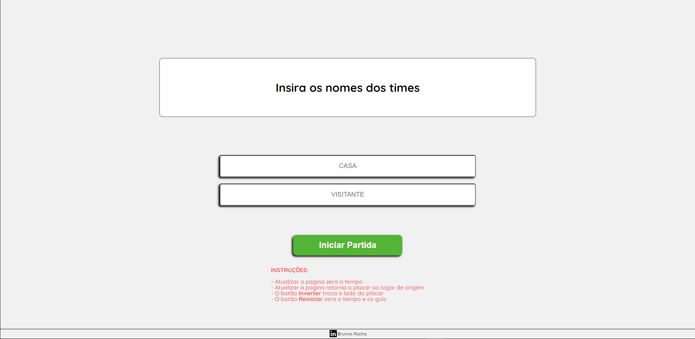
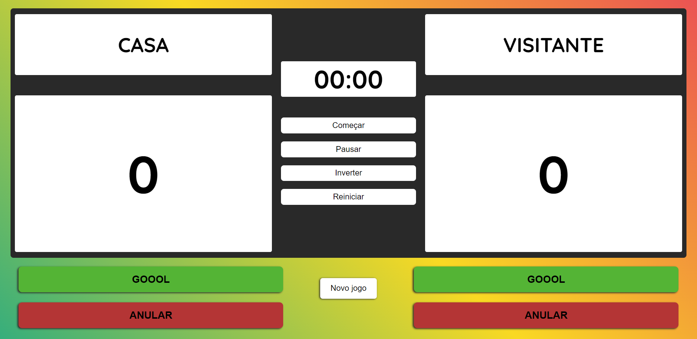

<h1 align="center">Projeto: Placar virtual</h1>

<h2 align="center">Sobre o projeto :dart:</h2>

 É um placar virtual para marcar o tempo e os gols de partidas pequenas que desejam ter uma organização e melhor controle. O placar pode ser usado em um dispositivo movel ou desktop.

<h2 align="center">Funcionalidades do projeto :hammer:</h2>
- `Funcionalidade 1`: Inserir o nome dos times;
- `Funcionalidade 2`: Temporizador com pause;
- `Funcionalidade 3`: Inverter o lado do placar para mudança de campo dos times;
- `Funcionalidade 4`: Reiniciar partida retornando os lados originais e zerando o tempo e os gols;
- `Funcionalidade 5`: Botão para marcar gol e anular caso necessário;
- `Funcionalidade 6`: Novo jogo para mundaça de times;

<h2 align="center">Tecnologias utilizadas :hammer_and_wrench:</h2> 

<h2 align="center">Deploy :link: </h2>
<a href="https://placar-hmpv3hnw4-brunnorch.vercel.app/index.html" target="_blank">Link para testar o projeto</a>

<h2 align="center"> Prints do projeto </h2>
 
<h3 align="center">Tela inicial</h3>

 
<h3 align="center"> Tela do placar </h3>
 

<h2 align="center"> Contributor :man_technologist:</h2>

<table align="center">
<tbody>
<tr>
<td align="center">
 <b>Brunno Rocha</b>
 

</td>
</tr>
</tbody>
</table>
